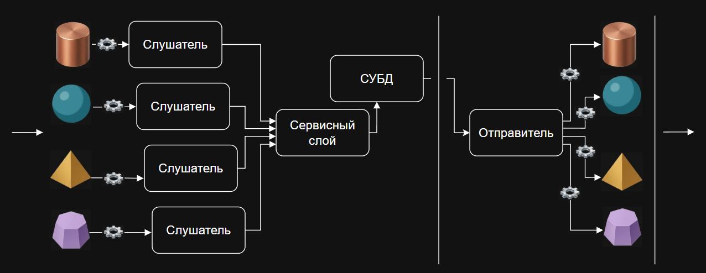
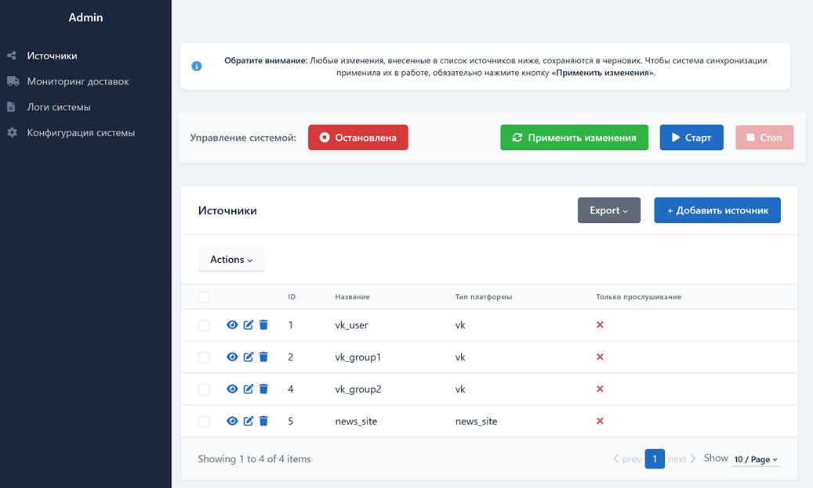
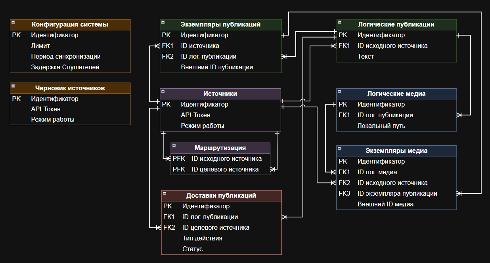
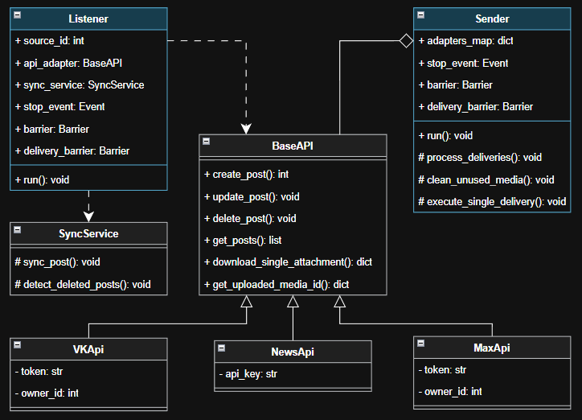

# 🔄 Система автоматизированной синхронизации контента

Программный комплекс для многосторонней репликации и синхронизации новостей, цен и медиафайлов между независимыми цифровыми платформами. 

## ⚙️ Принцип работы системы

Система функционирует в многопоточном режиме и разделена на две основные фазы, изолированные друг от друга:



1. **Сбор данных:** Для каждого подключенного источника контента выделяется собственный независимый поток — Слушатель. Он циклически опрашивает API своей платформы и передает полученный набор публикаций в сервисный слой, который выявляет изменения и формирует очередь задач в базе данных. 
2. **Рассылка контента:** За это отвечает отдельный поток — Отправитель. Он последовательно извлекает задачи из очереди СУБД, скачивает связанные медиавложения и через API-адаптеры публикует их на целевых площадках, контролируя статус выполнения. 

---

## 🌟 Ключевые особенности

- **Равноправие источников:** Отсутствует единая панель автора. Контент можно создавать, изменять или удалять в любой подключенной платформе.
- **Многопоточное ядро:** Независимые потоки-Слушатели опрашивают внешние API, а поток-Отправитель выполняет рассылку.
- **Защита от дубликатов:** Двухфазная барьерная синхронизация и разделение контента на логические сущности полностью исключают появление циклического «эха» публикаций.
- **Высокая отказоустойчивость:** Система поддерживает повторные попытки отправки, частичную публикацию контента при сетевых сбоях и автоматическую очистку сервера.

---

## 🛠️ Технологический стек

- **Язык разработки:** Python
- **Ядро синхронизации:** threading, requests
- **База данных:** PostgreSQL, SQLAlchemy (ORM)
- **Панель управления:** FastAPI, SQLAdmin
- **Безопасность:** Fernet (шифрование токенов доступа)

---

## 🖥️ Интерфейс административной панели

Панель позволяет полностью контролировать систему синхронизации: запускать и останавливать, менять конфигурацию, просматривать очередь активных доставок и логи системы. Все изменения сначала сохраняются в безопасном черновике, чтобы их применить нужно нажать соответствующую кнопку, после чего система перезапустится с обновленными параметрами.



---

## 📐 Архитектура системы

### Модель базы данных
Структура СУБД разделяет публикации и медиафайлы на логические сущности и экземпляры площадок. Разделение публикаций и медиафайлов на логические сущности и конкретные экземпляры решает сразу две ключевые задачи. Во-первых, это фундамент для алгоритма исключения дубликатов публикаций на всех площадках. Во-вторых, это позволяет скачивать и хранить тяжелые медиавложения на диске сервера в единственном экземпляре без повторов. 



### Диаграмма классов
Управляющие потоки полностью изолированы от технической специфики внешних платформ за счет использования единого базового класса-адаптера.

<p align="center">
  
</p>

---

## 🚀 Как запустить проект

1. **Клонируйте репозиторий:**
   ```bash
   git clone https://github.com
   cd имя_репозитория
   ```

2. **Настройте переменные окружения:**
   Создайте файл `.env` в корне проекта по следующему шаблону:
   ```env
   # Настройки подключения к СУБД PostgreSQL
   DB_HOST=localhost
   DB_PORT=5432
   DB_USER=your_db_user
   DB_PASS=your_db_password
   DB_NAME=your_db_name
   
   # Секретный ключ шифрования токенов (алгоритм Fernet)
   # Сгенерировать можно через: Fernet.generate_key().decode()
   ENCRYPTION_KEY=your_generated_fernet_key
   ```

4. **Установите зависимости:**
   ```bash
   pip install -r requirements.txt
   ```

5. **Запустите веб-сервер административной панели:**
   ```bash
   uvicorn admin_panel:app --reload
   ```
